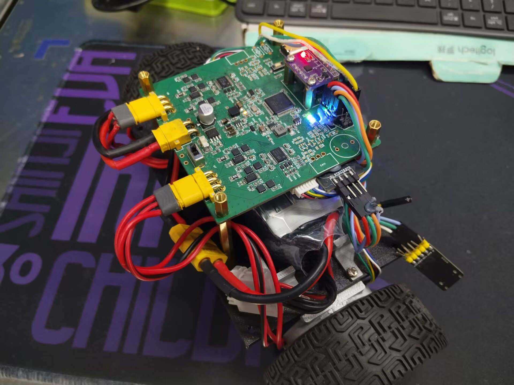
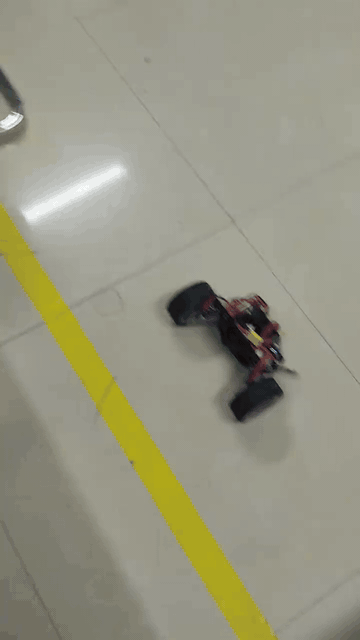
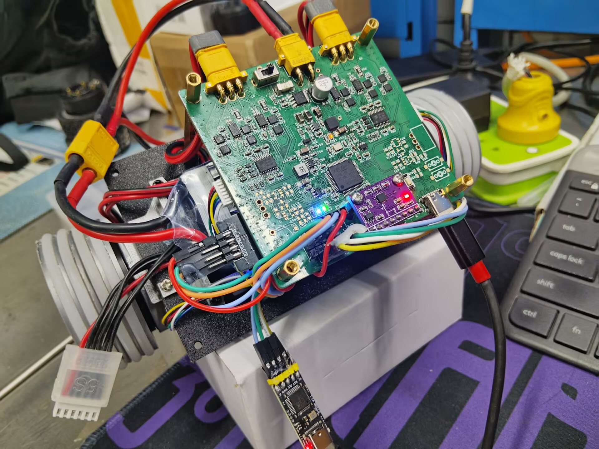
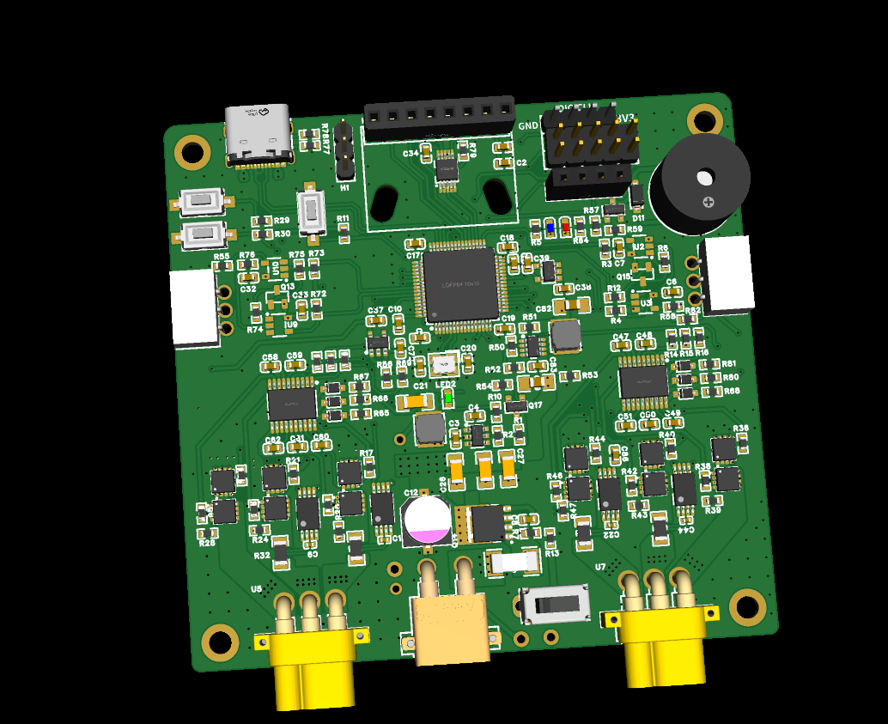

 FOC-Balance-Car

基于 **STM32G474** 的双电机 FOC 自平衡车控制平台。

项目围绕双电机有感 FOC、自平衡控制和实机调试展开，当前已实现 AS5047P 编码器闭环、Iq 电流环、速度/姿态串级控制、上电电角度零位标定，以及基于串口的 DebugLink GUI/CLI 调试工具。

<p align="center">
  
</p>

## Demo

### 倒伏状态自主恢复

小车可从倒伏状态主动恢复到直立姿态，并继续保持自平衡。

<p align="center">
  
</p>

### 外力扰动恢复

在外力推扰造成明显姿态和位置偏移后，小车能够重新恢复平衡。

<p align="center">
  
</p>

## Features

- STM32G474 双电机有感 FOC
- AS5047P 14-bit 单圈绝对式磁编码器位置反馈
- Clarke / Park / 反 Park 变换
- min-max 零序注入方式 SVPWM
- 上电自动电角度零位标定
- 双电阻相电流采样，PWM 同步 ADC 硬件触发 + DMA
- Iq 电流闭环，采用电阻压降前馈 + PI
- 速度 PI → 姿态 PD → Iq 电流环的多速率串级控制
- ICM42688 IMU 姿态采集
- DebugLink GUI / CLI：状态监视、参数读写、控制指令和 FastRing 数据采集

### 实时控制频率

| 模块 | 频率 / 时序 |
| --- | --- |
| PWM | 20 kHz，中心对齐 |
| ADC 电流采样 | 约 40 kHz，硬件触发 + DMA |
| Iq 电流环 | 10 kHz |
| 姿态环 | 1 kHz |
| 速度环 | 100 Hz |

## Hardware

<p align="center">
  
</p>

项目采用自制 **4 层控制/驱动一体 PCB**，将 MCU、双电机功率驱动、电流采样、传感器和调试接口集成到单板上。

| 模块 | 器件 / 配置 |
| --- | --- |
| MCU | STM32G474 |
| Motor | GB4310，14 极对 |
| Encoder | AS5047P，14-bit 磁编码器 |
| IMU | ICM42688 |
| Gate Driver | FD6287T |
| MOSFET | WSD6036DN33 |
| Current Sense | 20 mΩ 分流电阻 + INA240A1 |
| Power | 5S 锂电 |

### PCB 3D Render

<p align="center">
  
</p>

> 原理图、PCB 源文件及更完整的硬件说明仍在整理中，当前仓库暂未提供完整硬件设计文件。

## Software Architecture

固件工程位于 `code/BL_Pro_RET6/`。核心自编代码集中在 `MyCode/`，STM32Cube 生成代码和 HAL/CMSIS 保持独立。

```text
code/BL_Pro_RET6/
├── Core/                       # STM32Cube generated core files
├── Drivers/                    # STM32 HAL / CMSIS
├── Middlewares/                # Middleware dependencies
├── MyCode/
│   ├── Application/            # Vehicle-level control and scheduling
│   ├── Algorithm/              # PID / control algorithms
│   ├── SimpleFOC_Learning/     # FOC, current sensing, encoder and driver layer
│   └── System/                 # DebugLink and system services
├── tools/                      # DebugLink host tools
├── CMakeLists.txt
└── BL_Pro_RET6.ioc
```

当前 FOC 主链路包括：

- AS5047P 机械角采集与连续角/速度计算
- 机械角 → 电角度换算与上电零位标定
- 两相电流采样与 Clarke / Park 变换
- Iq 电流闭环
- 反 Park 与三相电压计算
- min-max SVPWM
- 左右电机驱动与镜像相位映射处理

> 当前实现为 **Iq 电流闭环**，并非完整的 Id/Iq 双电流环。

## DebugLink

固件提供基于 USART 的 DebugLink 调试接口，Host 端包含 Python GUI 和 CLI。

当前工具支持：

- 实时状态监视
- 参数读取与写入
- Driver On/Off
- Balance On/Off
- 速度环、姿态环参数调整
- FastRing 高速数据采集
- CSV 导出与离线分析

Host 工具说明见：

```text
code/BL_Pro_RET6/HOST_TOOLS.md
```

## Getting Started

### Firmware

固件工程入口：

```text
code/BL_Pro_RET6/
```

可使用现有 STM32CubeIDE / CMake 工程进行编译，并通过 ST-Link 下载至 STM32G474。

如需查看或修改 CubeMX 外设配置，可打开：

```text
code/BL_Pro_RET6/BL_Pro_RET6.ioc
```

### DebugLink GUI

Windows / PowerShell：

```powershell
cd code/BL_Pro_RET6
./run_gui.ps1
```

脚本会使用项目的 GUI 依赖配置启动 DebugLink 上位机。实际联机需要连接对应串口和硬件平台。

## Project Status

- [x] 双电机有感 FOC
- [x] AS5047P 编码器闭环
- [x] Iq 电流环
- [x] 上电电角度零位标定
- [x] 速度环 / 姿态环
- [x] 持续自平衡
- [x] 倒伏状态自主恢复
- [x] 外力扰动后恢复平衡
- [x] DebugLink GUI / CLI
- [ ] 完整硬件设计文件整理
- [ ] 详细控制与实时调度文档
- [ ] Host tools 进一步整理

## Notes

- 项目中的 SVPWM / 部分电机控制实现参考了 SimpleFOC 的设计思路，并结合本项目硬件和控制架构进行了适配。
- PCB 控制与功率驱动部分由本项目完成集成设计与实机调试，部分功率级设计参考了成熟开源方案。
- 仓库以当前可运行主线为准，早期实验代码和过时开发记录未继续保留在公开主目录中。

## References

- [SimpleFOC / Arduino-FOC](https://github.com/simplefoc/Arduino-FOC)
- STM32G4 HAL / CMSIS
- AS5047P Datasheet
- ICM42688 Datasheet

## License

当前仓库尚未添加项目级开源许可证。若需要复用、分发或二次开发，请等待后续 LICENSE 说明。
